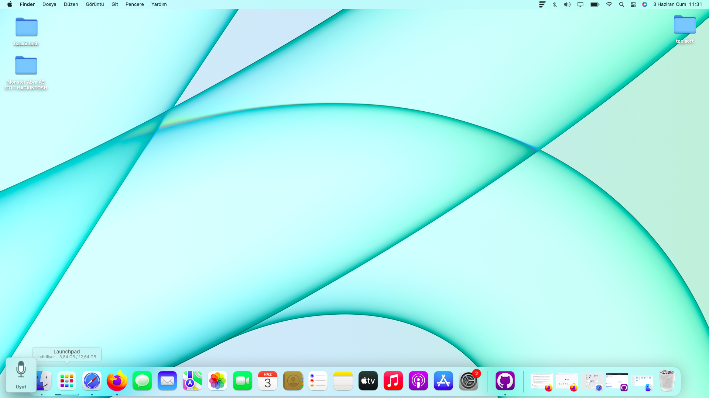
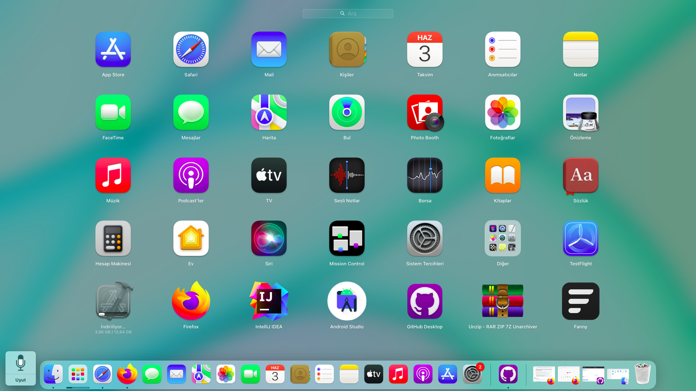
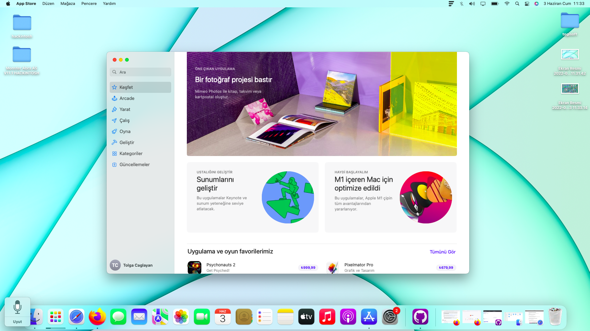

# Monster Abra A5 V11.1 Hackintosh EFI
 Monster Abra A5 V11.1 Hackintosh EFI Folder
 
 Sistem özellikler:
 * intel core i7-7700HQ
 * intel 630 hd ekran kartı
 * nvidia gtx-1050
 * 16 GB RAM
 * intel wifi card
 * Realtek high defination
 
 
 Çalışan özellikler:

 * Wifi
 * Airdrop
 * Ses ve Mikrafon
 * Pil
 * Ekran parlaklığı
 * Siri
 * Sesli komutlar 
 * intel ekran kartı sorunsuz çalışmakta
 * Bluetooth çalışmıyor onun haricinde tüm işlevler çalışmaktadır (Xcode, android studio ve birçok programı kullanıyorum ısınma sorunu yok)

<h1>NOT: Düzenleme yapmadan kullanmaya çalışmayın çalışmayacaktır. Tüm sorumluluk size aittir.</h1>

Bu adresten monterey 12.4 sürümünü indiriniz:
https://www.olarila.com/topic/6278-hackintosh-and-macintosh-olarila-vanilla-images-macos/

Bu adresteki program ile USB belleğinize yazdırabilirsiniz:
https://www.balena.io/etcher/

config.plist dosyasını düzenleyip ayarlamak için kullanılcak program:(Windows, Linux ve Macosda kullanılabilir.Ben kurulum dosyasını linuxda oluşturdum siz istediğiniz sistemde yapabilirsiniz.)
https://github.com/ic005k/OCAuxiliaryTools/releases

Adımlar:
 * indirdiğinz raw dosyasını balena etcher ile usb diskinize yazdırınız (16GB veya 32GB Usb kullanınız)
 * config.plist dosyasını opencore configurator programı ile açın ve düzenleyin. Serial numarası oluşturun kaydedin diğer ayarlar hazır halde.Bu işlemi düzgün yapmaz iseniz appstore ve birçok özellik çalışmaz.
 * bu işlemden sonra efi birimini mount edin içine EFI klasörünü atın.
 * işlem tamamdır. Bilgisayarı yeniden başlatın boot menusünden flash belleği seçin. 1 kez nvmreset yapın ve kuruluma geçin.

<h3> Ekran görüntüleri </h3>

 
 
 
 

